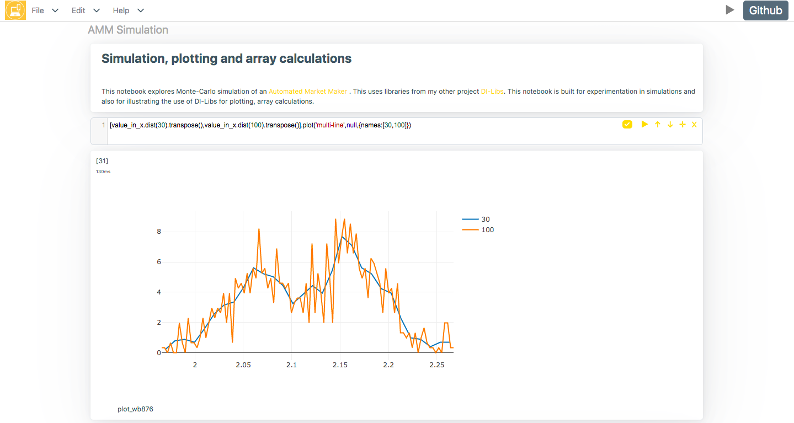

### Experiment in JavaScrip With Ease

- Runs without backend. 
- Can be loaded from the file system.
- Has a minimalistic UI.
- Minimal external libraries or frameworks.
- Comes pre-loaded with Plotly and DI-Libs.
- Thirdparty libraries can be loaded dynamically.

### Usecases
Scribbler can be used for:
- Scientific/Mathematical Computation
- Interactive Data Science/Machine Learning
- Dashboarding/Charting/Visualization
- Experimenting With New Code/Libraries

## Getting Started
{:.mt-lg-0}

### Installing
No specific installation is required. Clone this repository (git clone or better still - download) on any machine and double-click index.html. That's it. No Ngnix, no npm, no node, no pip install, no apt-get install. If you want to host the app online, you can put the folder in web directory of the server and use the link to index.html. You can also try the git-hosted version (without downloading anything) here: [https://app.scribbler.live/#](https://app.scribbler.live/#)

### Code 
Easy to start:
    
    show("Hello World")
        
Simple interface for array manipulation and charting:
    
    range(0,10,0.01).map(Math.sin).plot() //Plots a sin graph
    
### Example Notebooks
A hello-world notebook: [https://app.scribbler.live/#./examples/Hello-world.jsnb](https://app.scribbler.live/#./examples/Hello-world.jsnb). More examples are added in the folder examples/ in [Scribbler repository](https://github.com/gopi-suvanam/scribbler). Check the [Samples page](/documentation/samples.html) for links.
  

## Features
{:.mt-lg-0}

### Cells
The notebook consists of cells. Each cell will have user inputted html/code and an output. There is a menu at the top right corner of the cell (or above the cell in case of smaller screens). There are two types of cells: code and html. The type of cell can be toggled using a switch in the cell menu. For code cells input and output are both shown. For html cells, input is hidden and opens up if you click the output.

### Actions
To get the output of a cell press play ► button on the cell menu (or Cmd/Ctrl-Enter on keyboard after selecting the cell). The cell menu also has buttons for moving the cell up ↑, down ↓, adding a new cell ✛ and deleting the current cell ☓.

### Saving
A notebook can be downloaded as json (has a default extension of .jsnb). IT can be loaded back into the app. The notebook or only the output can also be downloaded as html.

### Loading
A .jsnb file can also be directly loaded into the app by suffixing the url of the file after "#" something like: https://app.scribbler.liv/#link_to_file.jsnb. The url of the file should be accessible by the browser through GET method.

