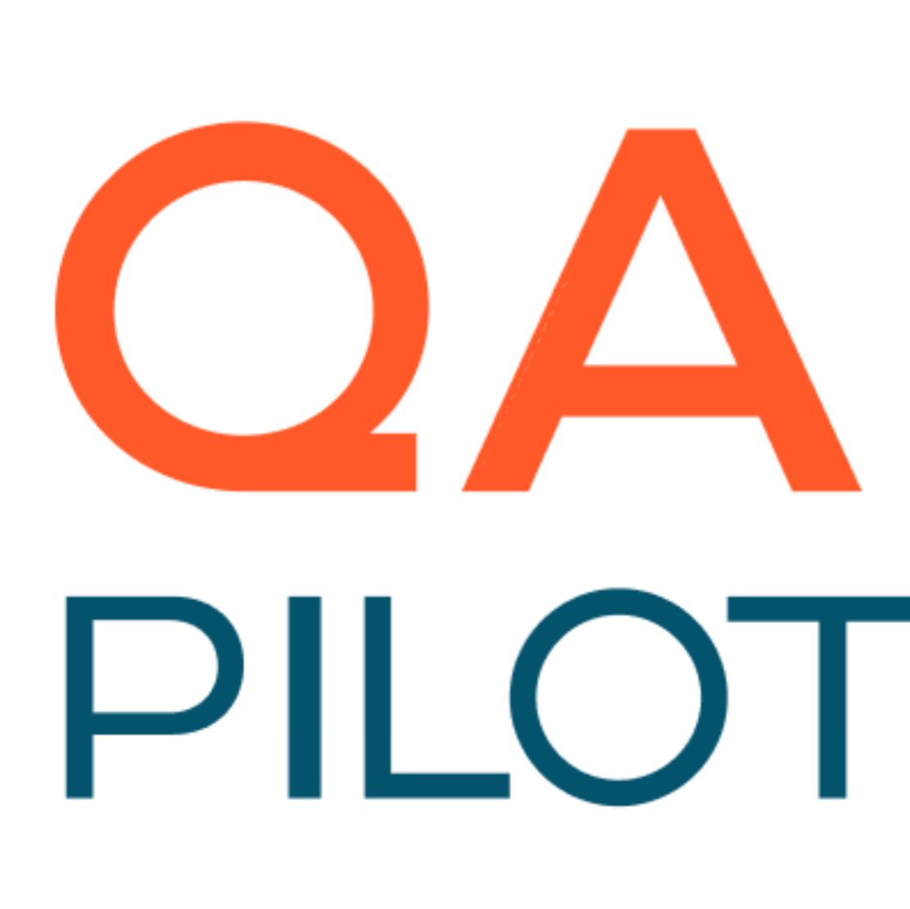
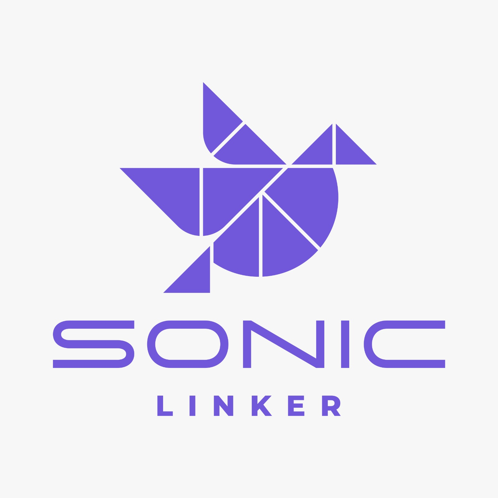

We’re thrilled to announce the **Summer of Scribbling - 2025**, a 15-day online hackathon that challenges developers, students, and creators to build powerful, creative applications using **Scribbler — the JavaScript Notebook**. Whether you're a data viz nerd, an AI enthusiast, or an XR dreamer, there's a theme for you.

#### 🚀  Dates: May 20–31, 2025

#### Watch out this space for the registration link and more announcements

---
## Hackathon Details

### 🗓️ Important Dates

* **Hackathon Start**: May 20, 2025
* **Submission Deadline**: May 31, 2025 (11:59 PM IST)
* **Demo & Judging**: June 1–2, 2025
* **Results Announcement**: June 3, 2025

### 👨‍💻 Who Can Participate?

* Individuals or teams of **1 to 4 members**
* Open to students from any field - anyone who loves building in JavaScript!

### 🧾 Submission Rules

1. All teams must **register and submit** via [hub.scribbler.live](https://hub.scribbler.live).
2. Code must be in a **Scribbler notebook** (HTML + JS), with any external libraries loaded via `scrib.loadScript(...)` or `import()`.
3. Each team member must **⭐ star the Scribbler GitHub repo** [here](https://github.com/scribbler-notebook/scribbler).
4. Projects must be original and built during the hackathon period.

### 🏆 Prizes

* 🏅 **1st Place**: Android Tablet + Goodies + Internship Opportunity
* 🥈 **2nd Place**: Mechanical Keyboard + Goodies
* 🥉 **3rd Place**: Gaming Mouse + Goodies
* 🎁 Goodies & internship interviews for notable contributors

---

## 🎯 Themes

Choose any of the following themes for your submission:

### 🧠 1. AI (API or In-Browser)

Participants can:

* Use **AI APIs** (like OpenAI, Cohere, HuggingFace Inference API, AssemblyAI, etc.)
* Or run models **fully in-browser** (e.g., WebLLM, TensorFlow\.js, ONNX.js) for a **bonus**.

#### 🔹 Theme Ideas:

| **Project Idea**          | **Description**                                                                      |
| ------------------------- | ------------------------------------------------------------------------------------ |
| **EmotionCam**            | Use webcam and either API (e.g., Affectiva) or browser ML to detect facial emotions. |
| **Ask My Doc**            | Upload a PDF and ask questions via LLM (OpenAI API or WebLLM).                       |
| **Smart Summarizer**      | Paste article or video transcript → get summary + key points.                        |
| **Voice Commands Bot**    | Use browser mic + API (e.g., Whisper) to recognize voice commands and reply via LLM. |
| **Chat with Spreadsheet** | Upload Excel/CSV and query it using an API-backed LLM (like GPT).                    |
| **Browser Tutor (Bonus)** | A tutor bot that runs *entirely* in the browser using WebLLM + math.js.              |
| **In-Browser Classifier** | Use TensorFlow\.js to build a working image or gesture classifier.                   |
| **Hybrid AI Agent**       | Use both browser and API AI — e.g., do vision in browser, NLP via API.               |

#### 🎁 Bonus Points: Fully browser-based AI using WebGPU/Wasm etc

Great — focusing your Scribbler hackathon on **AI**, **Dashboarding**, and **XR** plays perfectly to Scribbler's browser-native, JS-powered strengths. Here's a curated list of theme ideas under each of those three buckets:

### 📊 2. Dashboarding & Visualization

Use Plotly.js, D3, Chart.js, ObservablePlot, or WebGL-powered visualizations.

#### 🔹 Theme Ideas:

* **Smart City Dashboard**: Combine open datasets (air quality, traffic, weather) into a live dashboard.
* **Crypto Tracker**: Live charts of top coins, sentiment analysis of news/Twitter, and prediction trends.
* **Personal Health Tracker**: Allow users to input or import fitness/health data and visualize trends.
* **Startup Metrics**: Simulate or import mock metrics for user growth, churn, revenue, and visualize with cohort analysis.
* **Election Pulse**: Build a polling dashboard with real-time visualizations and projections.

### 🕶️ 3. XR (Extended Reality in Browser)

Use face-api.js, TensorFlow\.js, WebXR, Three.js, A-Frame, or AR.js.

#### 🔹 Theme Ideas:

* **Try-on Filters**: Real-time face tracking with filters, masks, and effects — like Snap or Insta, but in a notebook!
* **AR Info Cards**: Point camera at objects (e.g., books, plants) and display interactive labels or facts.
* **3D Math Visualizer**: Use A-Frame to render 3D plots or vector operations in real space.
* **Virtual Whiteboard**: Collaborative whiteboard inside Scribbler using Three.js and drawing APIs.
* **Face-Controlled Games**: Build simple browser games controlled by head movement or eye blink.

#### Watch out this space for more accounements and registration link
#### Join the community on [Discord](https://join.scribbler.live) or check the [Scribbler Docs](https://scribbler.live/docs).

---

## Partners

We are proud to present our esteemed partners. These are bleeding edge startups working in AI. They have kindly offered to provide internship for the winning participants.

### QAPilot

[QAPilot](https://qapilot.io/) is an AI-Native testing platform for Modile Apps. With QAPilot reimagine your testing with AI – effortless, fast, and accessible to all!

Website: [https://qapilot.io/](https://qapilot.io/)

### Sonic Linker

[Sonic Linker](https://www.soniclinker.com/) is an AI-powered unified inbox for all business leads. With Sonic Linker you can supercharge your lead conversions with AI-powered instant replies to inquiries on WhatsApp, Instagram, Phone Calls, Email, and LinkedIn.

Website: [https://www.soniclinker.com/](https://www.soniclinker.com/)

### CleverNav Solutions

[CleverNav Solutions](https://clevernav.ai/) is building AI-powered solutions to redefine insurance experience. With CleverNav harness the power of GenAI to deploy cutting-edge solutions for exceptional business outcomes and empower sales and servicing agents to redefine how insurance is bought, sold and serviced.

Website:  [https://clevernav.ai/](https://clevernav.ai/)

---

