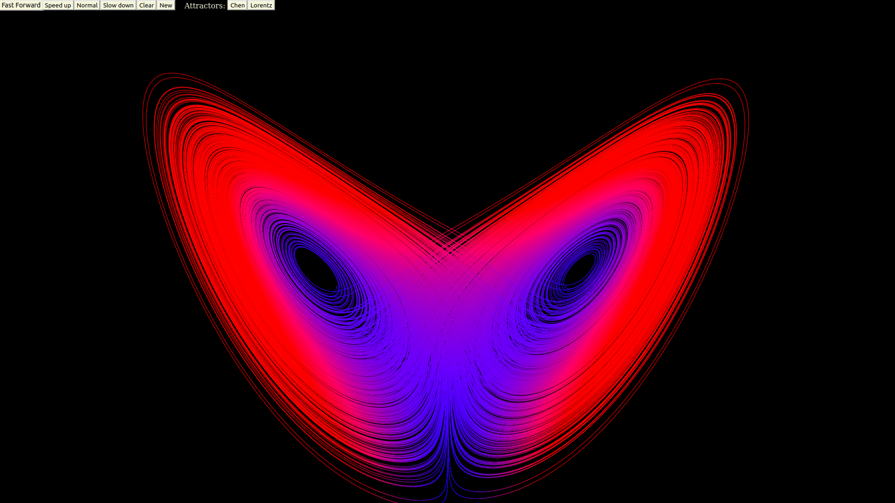
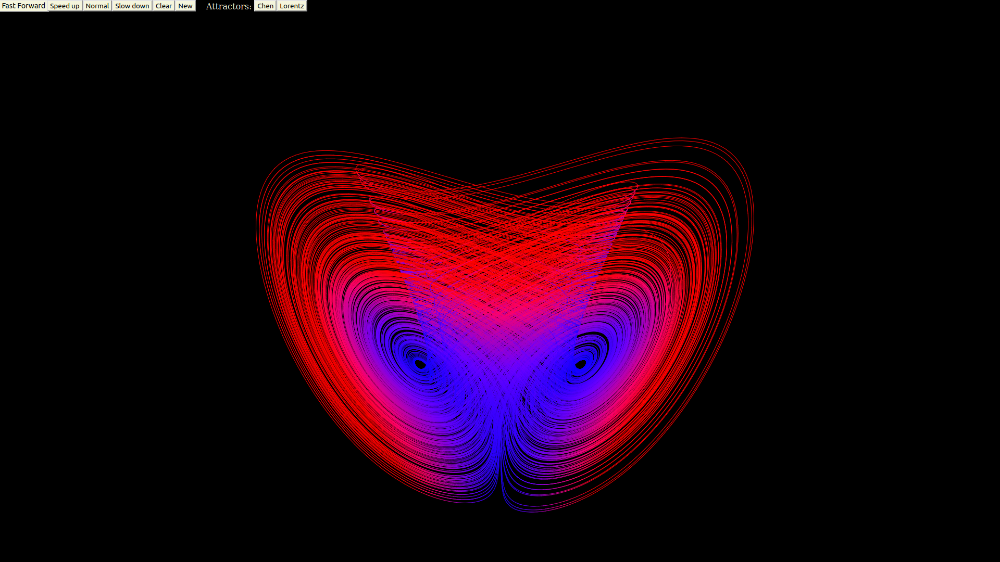

## Website <a src="https://sam-martis.github.io/ChaosTheoryAttractors/">https://sam-martis.github.io/ChaosTheoryAttractors/</a>

In this website, we plot differential equations using HTML5 Canvas and Javascript. The differential equations are solved sequentially using numeric methods.
When you go to the website, you will get the option of choose chen or lorentz attractors. In the future, more will be added.

In order to speed up or slow down the pen, click the respective buttons. 

Note, speeding up requires a sacrifise on computational accuracy and may lead to instabilities. 

Note: fast forward is not stoppable and unpredictable. Once used, it cannot be undone using slow down or normal. In order to change, click 'new'. Differnt browser/devcices will lead to different performances in fast forward.

Clear: clears screen but doesn't reset position

New: Reset's position

You can expect to see these two images if everything runs smoothly:

## Lorentz Attractor:

Read more about Lorenz Attractor <a href="https://en.wikipedia.org/wiki/Lorenz_system">here</a>

## Chen Attractor:

Read more about Chen Attractor <a href="https://en.wikipedia.org/wiki/Multiscroll_attractor">here</a>

